# Filter — Bedingungen, Einschränkung und Abfrageobjekt

> Stand: 2026-10-04, nach E1.8 (WP45) · Schema v2 · Beispieldaten
> `bern-mittelland-2026-10-03` · Bezug: [CONTEXT.md](../CONTEXT.md),
> [anforderungen.md](../anforderungen.md) (F-4.2 bis F-4.4, F-9.6),
> [design/e1](../design/e1/README.md) (B1, B2, B4, B8, B13),
> [schema/query-object/v2.json](../schema/query-object/v2.json)

Der Filter ist das Herz von GeoTandem: Er beantwortet die Frage *«Welche
Objekte des Ergebnis-Layers erfüllen meine Bedingungen?»*. Karte,
Trefferzahl, Attributtabelle, berechnete Spalten, gespeicherte Sitzungen und
Abfragen leiten sich alle aus ihm ab.

Das Dokument hat vier Teile:

1. [**Bedienung**](#1-bedienung): den Filter im Arbeitsplatz bauen (für Anwenderinnen und Anwender)
2. [**Beispiele**](#2-beispiele): acht Fragen an die Beispieldaten, mit Editor-Baum, Abfrageobjekt und Trefferzahl
3. [**Referenz**](#3-referenz-das-abfrageobjekt): das Abfrageobjekt, die Abbildung aus der Oberfläche, Fehler und Grenzwerte (für Entwicklung und Modus B)
4. [**Grenzen und Fallstricke**](#4-grenzen-und-fallstricke): was der Filter nicht kann, und wo er überrascht

---

## Überblick

Ein Filter besteht aus drei Teilen des **Analysezustands**:

| Teil | Im Arbeitsplatz | Im Abfrageobjekt |
|---|---|---|
| **Ergebnis-Layer** | «Ergebnis:» oben im Abfrage-Panel | `source` (bei abgeleiteten Layern dazu `buffer` oder `attribute_join`) |
| **Bedingungen** | UND/ODER-Baum im Abfrage-Editor | `where` |
| **Einschränkung** | «Nur in: Ausschnitt / Fläche» | mit `and` an `where` angehängt (`bbox` oder `geometry`) |

Die Oberfläche führt nie selbst etwas aus. Sie übersetzt den Zustand in ein
**Abfrageobjekt** ([frontend/src/analysis/query.ts](../frontend/src/analysis/query.ts)),
und nur die **Ausführungsmaschine** ([backend/src/geotandem/engine/](../backend/src/geotandem/engine/))
führt es aus. Modus B (LLM) schreibt dasselbe Abfrageobjekt, also gelten
dieselben Regeln und dieselben Grenzen.

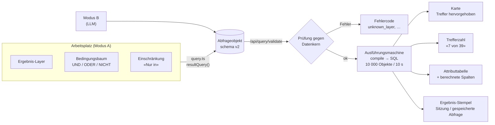

---

## 1 Bedienung

### 1.1 Ergebnis-Layer: wonach gefragt wird

Je Sitzung gibt es **genau einen** Ergebnis-Layer (Entwurf B1). Seine Objekte
sind die möglichen Treffer. Alle anderen Layer wirken nur als Bezug einer
Bedingung. Auf der Karte werden die Treffer hervorgehoben und die übrigen
Objekte gedämpft.

| Angezeigter Layer | Kann Ergebnis-Layer sein? |
|---|---|
| Katalog-Layer mit Geometrie | ✅ |
| Abgeleitet: **Puffer** | ✅ (siehe [4.6](#46-bedingungen-auf-einem-puffer-layer-prüfen-die-ursprüngliche-geometrie)) |
| Abgeleitet: **Join** | ✅, die verknüpften Felder sind wie eigene filterbar |
| Abgeleitet: **Aggregation** | ❌ (eine Aggregation fasst zusammen; Bedingungen würden *davor* filtern) |
| Tabellen-Layer (ohne Geometrie) | ❌ (nur in der Attributtabelle, Entwurf B11) |

**Wechsel des Ergebnis-Layers** (Entwurf B13): Attributbedingungen beziehen
sich auf die Felder des alten Layers und fallen weg. Der Dialog listet sie
vorher auf. Raum- und Bezugsobjekt-Bedingungen bleiben.

### 1.2 Der Bedingungsbaum

Der Abfrage-Editor (B2) zeigt die Bedingungen als Baum:

- Die **Wurzel** ist eine Gruppe mit **UND** oder **ODER**.
- **Gruppen** lassen sich beliebig tief verschachteln. Eine neue Gruppe
  übernimmt den Gegenoperator ihrer Elterngruppe (UND enthält ODER und
  umgekehrt).
- Jede Zeile und jede Gruppe hat ein **NICHT**.
- Es gibt drei Zeilentypen: **Attribut**, **Raum** und **Bezugsobjekt**.
- **Unvollständige Zeilen** (ohne Wert, ohne Layer, ohne Distanz) werden
  ignoriert und nie halbfertig gesendet. Eine leere Gruppe zählt nicht.
- **Keine Bedingung** heisst: alle Objekte sind Treffer.

So sieht der Baum von [Beispiel 6](#beispiel-6--verschachtelt-und-in-oder) aus:

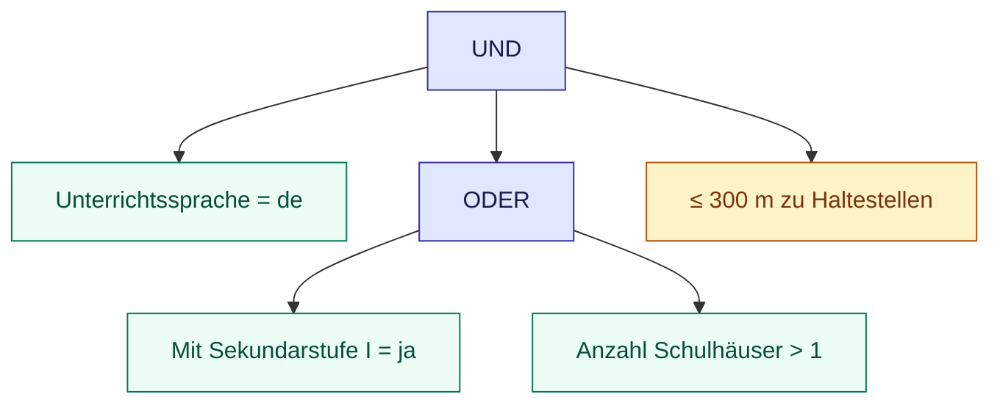

Grün: Attributbedingung · Gelb: Raumbedingung · Blau: Gruppe

### 1.3 Attributbedingungen

Welche Operatoren der Editor anbietet, hängt vom **Feldtyp** ab:

| Operator | Text | Ganzzahl / Dezimal | Datum | Ja/Nein |
|---|:-:|:-:|:-:|:-:|
| `=` | ✅ | ✅ | ✅ «am» | ✅ |
| `≠` | ✅ | ✅ | ✅ «nicht am» | |
| `<` `≤` `>` `≥` | | ✅ | ✅ «vor», «bis», «nach», «ab» | |
| zwischen | | ✅ | ✅ | |
| enthält · beginnt mit · endet mit | ✅ | | | |
| ist eins von | ✅ | ✅ | | |
| ist leer | ✅ | ✅ | ✅ | ✅ |

- **zwischen** schliesst beide Grenzen ein, und die Reihenfolge ist egal
  («zwischen 500 und 100» = 100 bis 500).
- **ist eins von** schlägt bei Feldern mit Werteliste (z. B. *Verkehrsmittel*:
  bahn, tram, bus, …) die Codes als Chips vor.
- **ist leer** findet Objekte ohne Wert. «hat einen Wert» ist **NICHT** + ist leer.
- **Text** (enthält, beginnt mit, endet mit) ignoriert Gross- und
  Kleinschreibung, auch bei Umlauten («änggi» findet «Änggisteibach»).
  Akzente zählen weiterhin. `=` und *ist eins von* vergleichen dagegen exakt
  (siehe [4.2](#42-text--und-ist-eins-von-sind-exakt)).
- **Datum** wird als `TT.MM.JJJJ` angezeigt und als ISO-Text `JJJJ-MM-TT`
  gesendet.

### 1.4 Raumbedingungen

Eine Raumbedingung fragt nach der Lage jedes Objekts des Ergebnis-Layers
relativ zu **irgendeinem** Objekt eines anderen Layers (dem *Bezugs-Layer*).

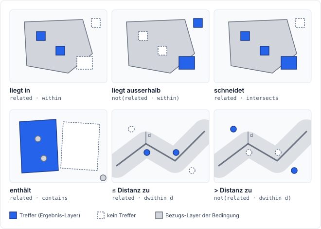

| Im Editor | Gilt für ein Objekt, wenn … | Abfrageobjekt |
|---|---|---|
| **liegt in** | es vollständig in einem Objekt des Bezugs-Layers liegt | `related` `within` |
| **liegt ausserhalb** | es in **keinem** vollständig liegt, also auch, wenn es über den Rand ragt | `not` `related` `within` |
| **schneidet** | es eines berührt oder überlappt | `related` `intersects` |
| **enthält** | es ein Objekt des Bezugs-Layers vollständig enthält | `related` `contains` |
| **≤ Distanz zu** | eines höchstens *d* Meter entfernt ist | `related` `dwithin` |
| **> Distanz zu** | **keines** höchstens *d* Meter entfernt ist | `not` `related` `dwithin` |

- **Filter auf den Bezugs-Layer:** Eine Raumzeile kann eine Attributbedingung
  auf den Bezugs-Layer tragen, z. B. «liegt in *Gemeinden* (Gemeindename =
  Köniz)» oder «≤ 300 m zu *Haltestellen* (Verkehrsmittel = bahn)».
- **Distanzen** sind Meter im metrischen internen CRS. Bei *≤ / > Distanz*
  muss die Distanz grösser als 0 sein, sonst ist die Zeile unvollständig.
- Als Bezugs-Layer stehen nur **Katalog-Layer mit Geometrie** zur Wahl,
  ausser dem Ergebnis-Layer selbst.

### 1.5 Bezugsobjekt: ein bestimmtes Objekt

«≤ 1,5 km um *Bern* (Haltestellen)» bezieht sich auf **ein** gewähltes
Objekt statt auf einen ganzen Layer (F-4.3). Mit Distanz 0 heisst die
Bedingung «bei …»: das Objekt muss das Bezugsobjekt berühren oder
überlappen. Im Abfrageobjekt wird daraus `near_feature` mit `layer` und
`fid`.

### 1.6 Einschränkung «Nur in»

Unter dem Baum, mit **UND** an alle Bedingungen gehängt:

| Chip | Wirkung | Abfrageobjekt |
|---|---|---|
| **Ausschnitt** | Treffer müssen den Kartenausschnitt **beim Klick** schneiden. Der Ausschnitt folgt der Karte danach nicht. | `bbox` |
| **Fläche** | Treffer müssen eine gezeichnete **Polygonfläche** schneiden | `geometry` `intersects` |

Es gilt höchstens eine Einschränkung: Ein Klick auf den anderen Chip ersetzt
sie, ✕ hebt sie auf (beim aktiven *Ausschnitt* auch ein erneuter Klick auf
den Chip).

> Nicht verwechseln: «nur aktueller Kartenausschnitt» in der
> **Attributtabelle** ist reine Anzeige und filtert nichts.

### 1.7 Trefferzahlen

- **«7 von 39»** im Abfrage-Panel zählt die Treffer aller Bedingungen und der
  Einschränkung gegen alle Objekte des Ergebnis-Layers.
- **Trefferzahl je Bedingung** (rechts neben jeder Zeile im Editor) zählt die
  Zeile **allein** auf dem Ergebnis-Layer, ohne die anderen Bedingungen und
  ohne die Einschränkung. Die Summe dieser Zahlen ergibt also nicht die
  Gesamtzahl. Sie zeigen, welche Bedingung wie stark einschränkt.
- Die **aktive Zeile** wird beim Bearbeiten auf der Karte gezeigt.
- Zählen ist nicht durch die 10 000-Objekte-Grenze beschränkt (siehe [3.6](#36-grenzwerte)).

### 1.8 Was der Filter sonst steuert

- **Berechnete Spalten** (B8): Für jede vollständige Raumzeile erhält der
  Ergebnis-Layer in der Tabelle eine Spalte, die zeigt, *warum* ein Objekt
  Treffer ist. Bei *≤ / > Distanz* und Bezugsobjekt ist das die Distanz
  («berechnet»). Bei *liegt in / ausserhalb / schneidet* sind es der Name und
  das gefilterte Attribut des Bezugsobjekts («aus Raumfilter»). *enthält*
  erzeugt keine Spalte.
- **Puffer «Nur gefilterte Objekte»** (B4): Ein Puffer um den Ergebnis-Layer
  puffert dann nur die aktuellen Treffer.
- **Sitzung** und **gespeicherte Abfrage** speichern Ergebnis-Layer, Baum und
  Einschränkung. Gespeicherte Abfragen sind nur auf Katalog-Layern möglich.
  Beim Öffnen läuft die Abfrage erneut, und der **Ergebnis-Stempel** meldet
  «identisch» oder «weicht ab».

---

## 2 Beispiele

Alle Zahlen stammen aus dem Beispieldatensatz `bern-mittelland-2026-10-03`
(74 Gemeinden, 137 Schulen, 961 Haltestellen, 179 Strassen). Jedes JSON ist
das Abfrageobjekt, das die Oberfläche erzeugt (ohne `schema_version`,
`output` und berechnete Spalten).

Die Beispiele sind ausführbar:
[test_filter_docs.py](../backend/tests/test_filter_docs.py) führt jedes JSON
aus und prüft «**Treffer** von **Gesamt**». Wer ein Beispiel oder den
Beispieldatensatz ändert, muss die Zahlen hier nachführen.

Die Bildschirmfotos zeigen jedes Beispiel im Abfrage-Editor (Stand
2026-10-04, ohne Grundkarte): links die Übersicht mit der Trefferzahl je
Bedingung, in der Mitte der Editor, rechts die Karte mit den Treffern in
Orange. Neu erzeugt werden sie mit `make doc-screenshots`
([scripts/doc-screenshots.sh](../scripts/doc-screenshots.sh)), sobald sich der
Editor oder ein Beispiel ändert. Der Lauf bricht ab, wenn eine Trefferzahl in
der Oberfläche nicht zum Dokument passt.

### Beispiel 1 — Primarschulen in Köniz

> Ergebnis: **Schulen** · UND: `Höchste Schulstufe = primar` · `liegt in Gemeinden (Gemeindename = Köniz)`
> → **4 von 137**  (Schulstufe allein: 62)

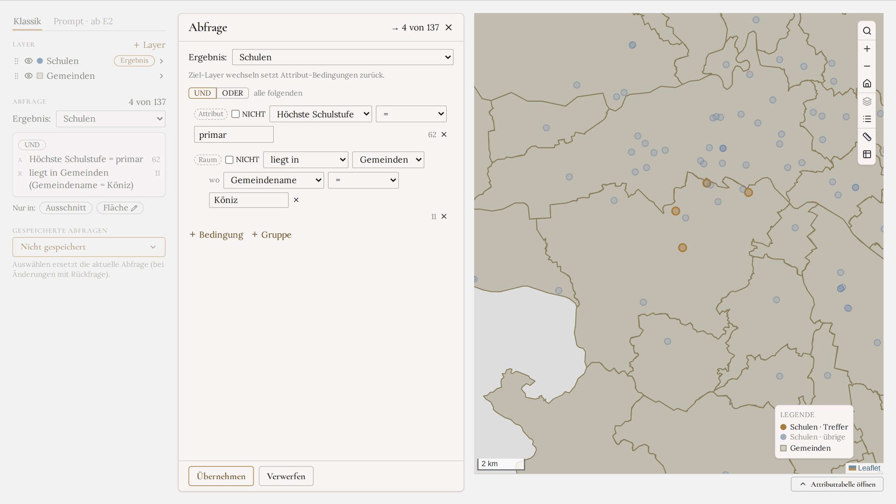

```json
{ "source": "schulen",
  "where": { "op": "and", "args": [
    { "op": "compare", "attr": "typ", "cmp": "eq", "value": "primar" },
    { "op": "related", "layer": "gemeinden", "predicate": "within",
      "where": { "op": "compare", "attr": "name", "cmp": "eq", "value": "Köniz" } } ] } }
```

Die Raumzeile filtert den Bezugs-Layer. In der Tabelle erscheint die
berechnete Spalte *Gemeindename (aus Raumfilter)*.

### Beispiel 2 — Gut erschlossene Haltestellen (ODER)

> Ergebnis: **Haltestellen** · ODER: `Haltestellenkategorie ist eins von I, II` · `Verkehrsmittel = bahn`
> → **282 von 961**  (je Bedingung: 244 und 82)

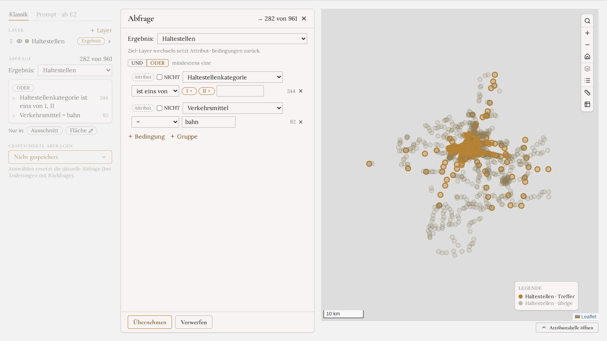

```json
{ "source": "haltestellen",
  "where": { "op": "or", "args": [
    { "op": "in", "attr": "kategorie", "values": ["I", "II"] },
    { "op": "compare", "attr": "verkehrsmittel", "cmp": "eq", "value": "bahn" } ] } }
```

244 + 82 > 282: Viele Bahnhaltestellen haben selbst Kategorie I oder II.

### Beispiel 3 — Schulen weiter als 1 km von einer Bahnhaltestelle

> Ergebnis: **Schulen** · `> 1 km zu Haltestellen (Verkehrsmittel = bahn)`
> → **48 von 137**

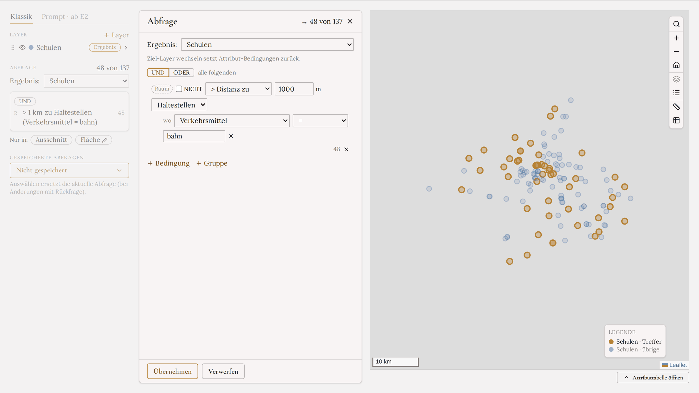

```json
{ "source": "schulen",
  "where": { "op": "not", "arg":
    { "op": "related", "layer": "haltestellen", "predicate": "dwithin", "distance_m": 1000,
      "where": { "op": "compare", "attr": "verkehrsmittel", "cmp": "eq", "value": "bahn" } } } }
```

*> Distanz* ist die Verneinung von *≤ Distanz*. Die Spalte *Distanz zu
Haltestellen* zeigt die Entfernung zur nächsten Bahnhaltestelle.

### Beispiel 4 — Gemeinden ohne Sekundarschule

> Ergebnis: **Gemeinden** · `NICHT enthält Schulen (Mit Sekundarstufe I = ja)`
> → **34 von 74**  (mit Sekundarschule: 40)

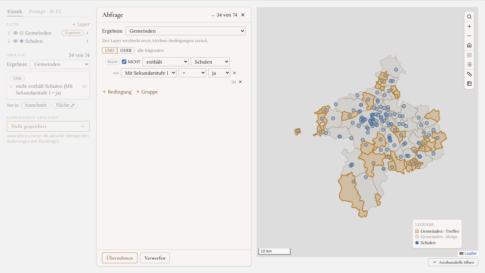

```json
{ "source": "gemeinden",
  "where": { "op": "not", "arg":
    { "op": "related", "layer": "schulen", "predicate": "contains",
      "where": { "op": "compare", "attr": "sekundarstufe", "cmp": "eq", "value": true } } } }
```

### Beispiel 5 — Gemeinden an der Aare

> Ergebnis: **Gemeinden** · `schneidet Gewässer (Name = Aare)`
> → **19 von 74**

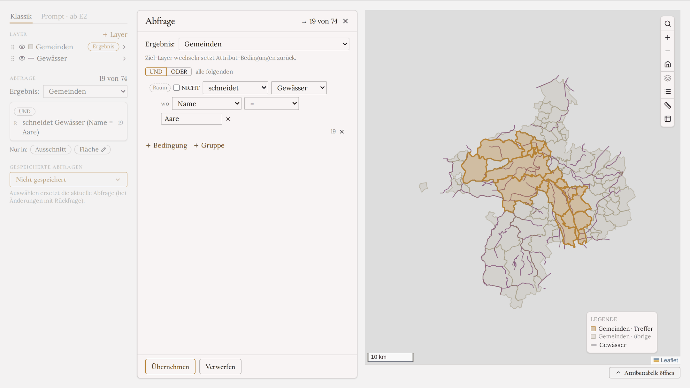

```json
{ "source": "gemeinden",
  "where": { "op": "related", "layer": "gewaesser", "predicate": "intersects",
    "where": { "op": "compare", "attr": "name", "cmp": "eq", "value": "Aare" } } }
```

### Beispiel 6 — Verschachtelt: UND in ODER

> Ergebnis: **Schulen** · UND: `Unterrichtssprache = de` · (ODER: `Mit Sekundarstufe I = ja` · `Anzahl Schulhäuser > 1`) · `≤ 300 m zu Haltestellen`
> → **81 von 137**  (Baum siehe [1.2](#12-der-bedingungsbaum))

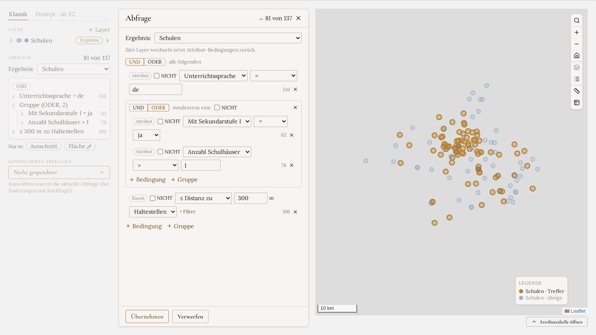

```json
{ "source": "schulen",
  "where": { "op": "and", "args": [
    { "op": "compare", "attr": "sprache", "cmp": "eq", "value": "de" },
    { "op": "or", "args": [
      { "op": "compare", "attr": "sekundarstufe", "cmp": "eq", "value": true },
      { "op": "compare", "attr": "standorte", "cmp": "gt", "value": 1 } ] },
    { "op": "related", "layer": "haltestellen", "predicate": "dwithin", "distance_m": 300 } ] } }
```

### Beispiel 7 — Bezugsobjekt: rund um den Bahnhof Bern

> Ergebnis: **Schulen** · UND: `≤ 1,5 km um Bern (Haltestellen)` · `Mit Sekundarstufe I = ja`
> → **4 von 137**  (Bezugsobjekt allein: 11)

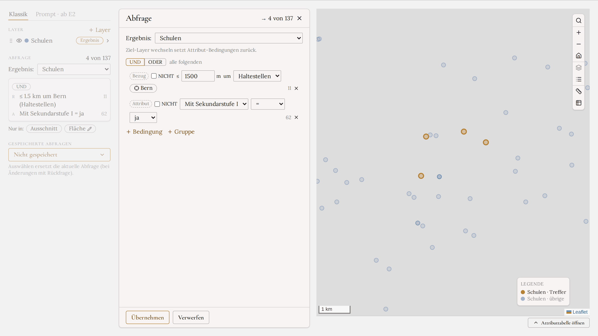

```json
{ "source": "schulen",
  "where": { "op": "and", "args": [
    { "op": "near_feature", "layer": "haltestellen", "fid": 47, "distance_m": 1500 },
    { "op": "compare", "attr": "sekundarstufe", "cmp": "eq", "value": true } ] } }
```

Das Bezugsobjekt wird über seine `fid` adressiert (hier 47 = Haltestelle
«Bern»). Die Spalte *Distanz* zeigt die Entfernung zu genau diesem Objekt.

### Beispiel 8 — Filtern auf verknüpften Sachdaten

Zuerst wird ein **Join** angelegt (Gemeinden + Gemeindedaten über
`gem_nr`, Felder *Einwohner* und *Steueranlage*). Dann wird der Join zum
Ergebnis-Layer.

> Ergebnis: **Gemeinden + Gemeindedaten** · UND: `Einwohner > 10 000` · `Steueranlage < 1,6`
> → **7 von 74**

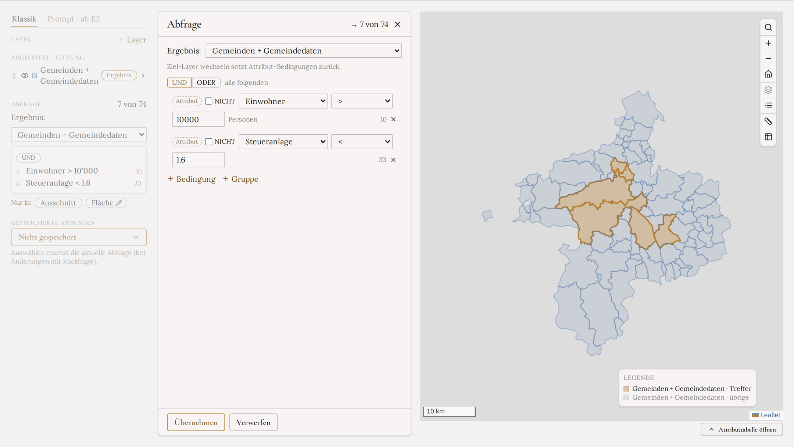

```json
{ "source": "gemeinden",
  "attribute_join": { "layer": "gemeindedaten", "left_key": "gem_nr", "right_key": "gem_nr",
                      "fields": ["einwohner", "steueranlage"] },
  "where": { "op": "and", "args": [
    { "op": "compare", "attr": "einwohner", "cmp": "gt", "value": 10000 },
    { "op": "compare", "attr": "steueranlage", "cmp": "lt", "value": 1.6 } ] } }
```

Ohne «Objekte ohne Partner behalten» hängt die Oberfläche
`not is_null(<erstes Feld>)` an und entfernt so Gemeinden ohne Sachdaten.

---

## 3 Referenz: das Abfrageobjekt

Massgeblich sind [packages/query/src/geotandem_query/models.py](../packages/query/src/geotandem_query/models.py)
und das daraus erzeugte [schema/query-object/v2.json](../schema/query-object/v2.json).
v0- und v1-Dokumente werden unverändert als v2 gelesen.

### 3.1 Auswertungsreihenfolge

Die Reihenfolge ist fest und hängt nicht von der Reihenfolge der Felder im
Dokument ab:

```mermaid
flowchart LR
    A["1 source<br/><i>Quell-Layer</i>"] --> B["2 attribute_join<br/><i>Sachdaten per Schlüssel</i>"]
    B --> C["3 where<br/><b>der Filter</b><br/><i>sieht die Originalgeometrie</i>"]:::filter
    C --> D["4 buffer<br/><i>Geometrie → Puffer</i>"]
    D --> E["5 spatial_relation<br/><i>sieht die gepufferte Geometrie</i>"]
    E --> F["6 aggregate<br/><i>je Fläche zusammenfassen</i>"]
    F --> G["7 columns<br/><i>berechnete Spalten</i>"]
    G --> H["8 select · order_by · limit"]
    classDef filter fill:#dbeafe,stroke:#1d4ed8,stroke-width:2px,color:#1e3a8a
```

`symbology` und `output` sind Darstellungshinweise. Sie werden geprüft, aber
nie ausgeführt.

### 3.2 Bedingungen (`Condition`)

| `op` | Felder | Bedeutung |
|---|---|---|
| `compare` | `attr`, `cmp` ∈ `eq ne lt le gt ge`, `value` | Vergleich mit einer Konstanten |
| `between` | `attr`, `min`, `max` | Bereich inklusive Grenzen, nur Zahlen; die Grenzen werden sortiert |
| `in` | `attr`, `values` (≥ 1) | Wert in Liste |
| `text_match` | `attr`, `text`, `mode` ∈ `contains starts_with ends_with equals`, `case_sensitive` (Standard `false`) | Textsuche, nur auf Textfeldern |
| `is_null` | `attr` | kein Wert |
| `bbox` | `bbox` `[lon, lat, lon, lat]` WGS84 | Geometrie schneidet Rechteck; die Ecken werden sortiert |
| `geometry` | `geometry` (GeoJSON WGS84), `predicate` ∈ `intersects within contains` | Beziehung zu einer gezeichneten Geometrie |
| `near_feature` | `layer`, `fid`, `distance_m` ≥ 0 | höchstens *d* m von einem Objekt |
| `related` | `layer`, `predicate` ∈ `intersects within contains`, optional `where` | Beziehung zu irgendeinem Objekt von `layer` (ab v1) |
| `related` | `layer`, `predicate: dwithin`, `distance_m` > 0, optional `where` | höchstens *d* m von irgendeinem Objekt von `layer` |
| `and` / `or` | `args` (≥ 1) | Verknüpfung |
| `not` | `arg` | Verneinung |

Raumprädikate lesen sich immer als **«Quelle *Prädikat* Bezug»**: `within`
heisst «das Quellobjekt liegt im Bezugsobjekt».

Ein `related.where` filtert den Bezugs-Layer und ist im Schema eine beliebige
Bedingung (auch `and`, `or`, verschachtelt). Die Oberfläche nutzt davon nur
eine Attributzeile.

### 3.3 Abbildung Oberfläche → Abfrageobjekt

| Editor | Abfrageobjekt |
|---|---|
| `=` `≠` `<` `≤` `>` `≥` | `compare` mit `eq ne lt le gt ge` |
| zwischen (Zahlen) | `between` |
| zwischen (Datum) | `and(compare ge, compare le)` mit ISO-Text |
| enthält · beginnt mit · endet mit | `text_match`, `case_sensitive: false` |
| ist eins von | `in` |
| ist leer | `is_null` |
| NICHT an Zeile oder Gruppe | `not` um die Bedingung |
| Gruppe UND / ODER | `and` / `or`; eine Gruppe mit einem Kind wird zu diesem Kind |
| liegt in · schneidet · enthält | `related` `within` / `intersects` / `contains` |
| liegt ausserhalb | `not related within` |
| ≤ / > Distanz zu | `related dwithin` / `not related dwithin` |
| Bezugsobjekt | `near_feature` |
| Nur in: Ausschnitt / Fläche | `bbox` / `geometry intersects`, mit `and` angehängt |

Die Übersetzung ist rein und vollständig getestet
([query.test.ts](../frontend/src/analysis/query.test.ts)). Jede Abfrage der
Oberfläche stammt aus [query.ts](../frontend/src/analysis/query.ts).

### 3.4 `related` (in `where`) oder `spatial_relation`

| | `where` → `related` | `spatial_relation` |
|---|---|---|
| Kombinierbar mit `and` / `or` / `not` | ✅ | ❌, eine einzige, immer UND |
| Sieht die Geometrie | **vor** `buffer` | **nach** `buffer` |
| Genutzt von | Abfrage-Editor | nur Modus B / API |

Beide sind Semi-Joins: Ein Quellobjekt erscheint höchstens einmal, auch wenn
es zu mehreren Bezugsobjekten passt.

### 3.5 Prüfung und Fehler

Das Schema prüft Form und Typen. Ob Layer und Attribute existieren, welchen
Typ sie haben und wer sie sehen darf, prüft der Datenkern
(`/api/query/validate`, gleicher Compiler wie die Ausführung).

| Code | HTTP | Wann |
|---|---|---|
| `unknown_layer` | 400 | Layer fehlt **oder ist für das Konto verborgen** (die Meldung nennt die verfügbaren) |
| `unknown_attribute` | 400 | Attribut fehlt (die Meldung nennt die verfügbaren) |
| `invalid_query` | 400 | falscher Werttyp (`"abc"` für eine Zahl, Datum nicht als ISO-Text), `text_match` auf Nicht-Text, ungültige GeoJSON-Geometrie, Namenskonflikte bei Join oder Spalten |
| `unsupported_operation` | 400 | Raumbedingung auf einem Tabellen-Layer, oder das Backend kann die Operation nicht |
| `result_too_large` | 413 | mehr als `max_features` Objekte |
| `query_timeout` | 504 | länger als `query_timeout_s` |

### 3.6 Grenzwerte

| Einstellung | Umgebungsvariable | Standard | Gilt für |
|---|---|---|---|
| `max_features` | `GEOTANDEM_MAX_FEATURES` | 10 000 | Objekte, die den Server verlassen (Karte, Tabelle). **Nicht** für Zählen und Ergebnis-Stempel. |
| `query_timeout_s` | `GEOTANDEM_QUERY_TIMEOUT_S` | 10 s | jede Ausführung, auch Zählen |

Eine Abfrage mit `limit` überschreitet `max_features` nie; ohne `limit` wird
sie abgewiesen statt abgeschnitten.

---

## 4 Grenzen und Fallstricke

### 4.1 Leere Werte fallen aus Bedingung *und* Verneinung

Ein Objekt ohne Wert (`NULL`) erfüllt weder `Haltestellenkategorie = I` noch
`NICHT … = I` noch `… ≠ I`. Das ist die dreiwertige Logik
von SQL.

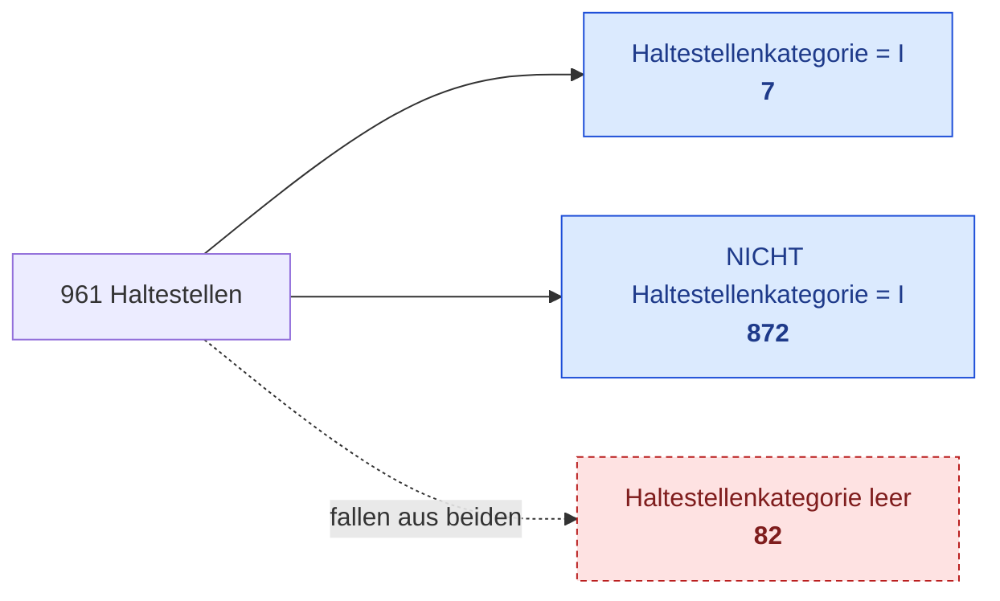

**Abhilfe:** Wer die leeren mitzählen will, nimmt eine ODER-Gruppe:
`ODER( NICHT Haltestellenkategorie = I, Haltestellenkategorie ist leer )`.

### 4.2 Text: `=` und «ist eins von» sind exakt

| Abfrage auf Gemeinden | Treffer |
|---|---|
| `Gemeindename = Bern` | 1 |
| `Gemeindename = bern` | **0** |
| `Gemeindename ist eins von bern` | **0** |
| `Gemeindename enthält bern` | 4 |

Nur *enthält / beginnt mit / endet mit* ignorieren die Gross- und
Kleinschreibung. Für «ist gleich, egal wie geschrieben» gibt es im Editor
keinen Operator. Das Schema kennt ihn (`text_match` mit `mode: equals`), er
ist aber nur über Modus B oder die API erreichbar.

Akzente zählen immer: «Munsingen» findet «Münsingen» nicht. Der Editor bietet
für Text kein `<` / `>` an. Im Abfrageobjekt folgen solche Vergleiche (und
`order_by`) der Sortierregel (Grundbuchstaben zuerst), nicht den Bytes:
«Ägerten» liegt bei A.

### 4.3 Bezugs-Layer: nur Katalog-Layer, nur eine Attributzeile

- Raumbedingungen und Bezugsobjekte beziehen sich **nur auf Katalog-Layer**
  mit Geometrie. Ein Puffer, ein Join oder eine Aggregation kann nicht
  Bezug einer Bedingung sein, der Ergebnis-Layer auch nicht.
- Der Filter auf den Bezugs-Layer ist im Editor **eine** Attributzeile.
  «liegt in Gemeinden (Fläche > 20 km² UND Name enthält berg)» geht nur über
  Modus B oder die API.
- Ein für das Konto verborgener Layer verhält sich wie ein nicht vorhandener
  (`unknown_layer`), auch als Bezug einer Bedingung.

### 4.4 «liegt ausserhalb» ist «NICHT liegt in»

Ein Objekt, das über den Rand des Bezugsobjekts ragt, liegt nicht vollständig
darin und gilt deshalb als **ausserhalb** (siehe Abbildung in
[1.4](#14-raumbedingungen), Mitte oben). Wer «berührt das Bezugsobjekt
nirgends» meint, nimmt **NICHT schneidet**.

### 4.5 Mehrere passende Bezugsobjekte

- Ein Treffer erscheint immer **einmal**, auch wenn er zu mehreren
  Bezugsobjekten passt.
- Die berechnete Spalte «aus Raumfilter» zeigt dann den Wert des Bezugsobjekts
  mit der **kleinsten `fid`**, nicht alle. Eine Strasse durch drei Gemeinden
  zeigt einen Gemeindenamen.

### 4.6 Bedingungen auf einem Puffer-Layer prüfen die ursprüngliche Geometrie

Ist ein **Puffer** der Ergebnis-Layer, gelten Raumbedingungen für die
**ursprünglichen** Objekte, nicht für die Pufferflächen, denn `where` läuft
vor `buffer` ([3.1](#31-auswertungsreihenfolge)).

| Ergebnis-Layer «Puffer 500 m um Schulen» | Treffer |
|---|---|
| Bedingung `schneidet Gewässer` (Oberfläche) | **0**, weil die Schulpunkte kein Gewässer schneiden |
| Pufferflächen, die ein Gewässer schneiden (`spatial_relation`, nur API) | 72 |

**Abhilfe:** Die Frage auf dem ursprünglichen Layer stellen: Ergebnis
**Schulen**, Bedingung `≤ 500 m zu Gewässer`.

### 4.7 Weitere Grenzen

| Grenze | Hinweis |
|---|---|
| Ergebnis-Layer wechseln verwirft Attributbedingungen | Der Dialog listet sie vorher auf (B13). Wer sie behalten will, speichert die Sitzung zuerst. |
| Aggregationen und Tabellen-Layer können nicht Ergebnis sein | Sie lassen sich über die Attributtabelle oder einen Join nutzen |
| Höchstens eine Einschränkung «Nur in» | Weitere Flächen: als Layer importieren und mit *liegt in* / *schneidet* filtern |
| Gezeichnete Fläche: nur Polygon, nur *schneidet* | `within` / `contains` nur über das Abfrageobjekt |
| Ausschnitt ist eingefroren | Aufheben und neu setzen, um den aktuellen Kartenausschnitt zu übernehmen |
| Datum: kein «ist eins von», kein «zwischen» im Schema | Die Oberfläche bildet «zwischen» als `≥ UND ≤` ab |
| Ja/Nein: nur `=` und *ist leer* | `≠ ja` ist `= nein` (leere Werte beachten, [4.1](#41-leere-werte-fallen-aus-bedingung-und-verneinung)) |
| Mehr als 10 000 Treffer | Karte und Tabelle zeigen `result_too_large`; die Trefferzahl funktioniert weiter. Bedingung oder Einschränkung enger fassen. |
| Gespeicherte Abfragen nur auf Katalog-Layern | Abgeleitete Ergebnis-Layer leben nur in der Sitzung |
