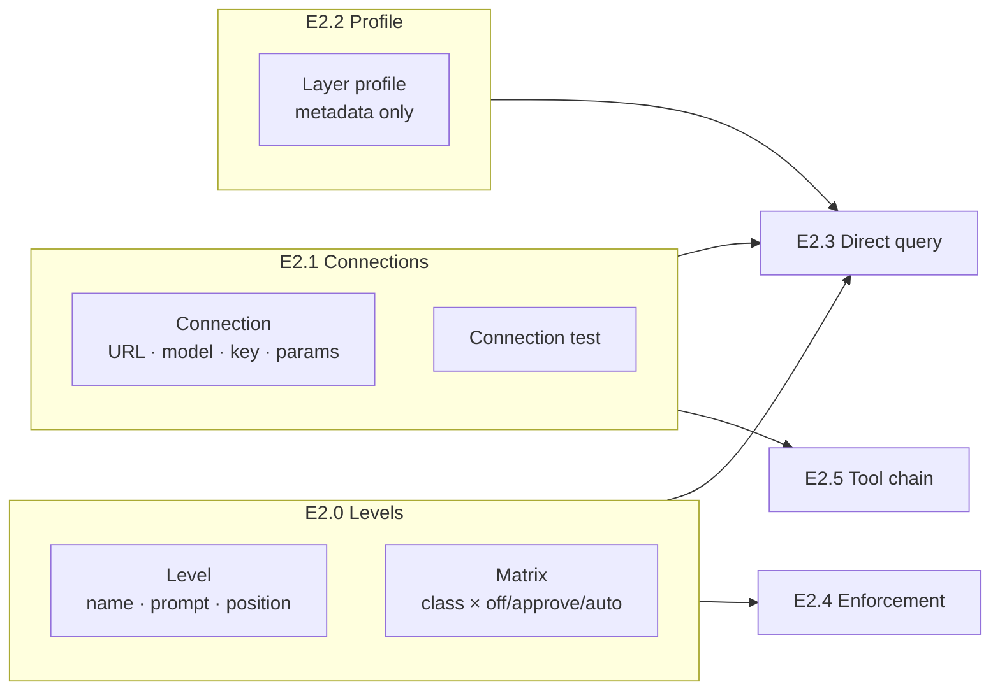
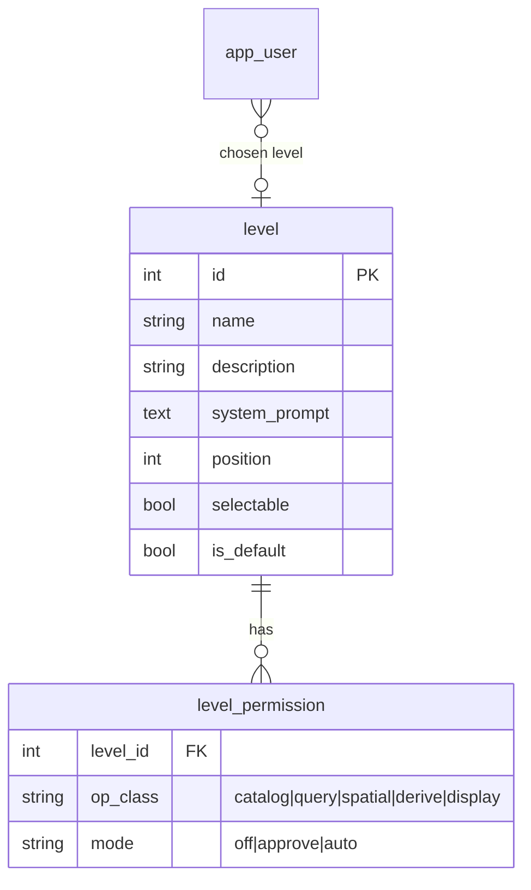
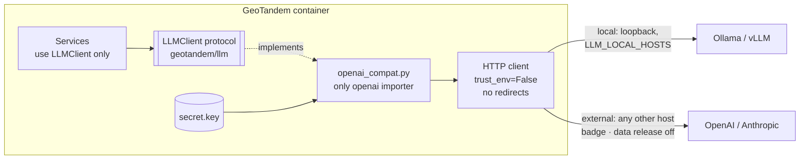
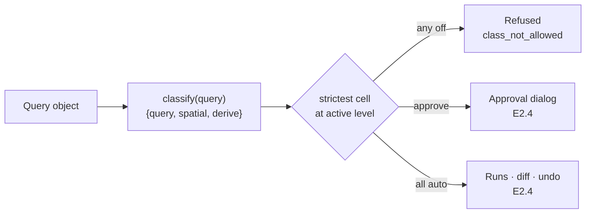
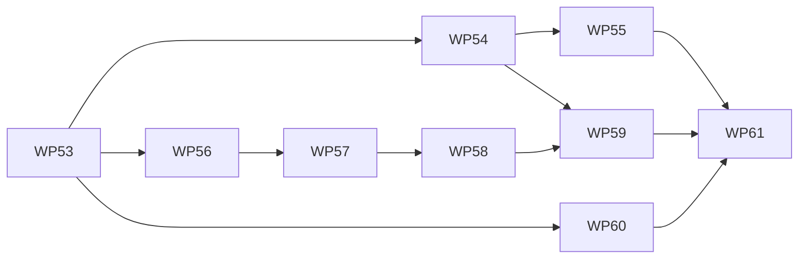

# Plan E2.0–E2.2 — Levels, model connections, layer profile

> Stand: 2026-10-08 · **umgesetzt (WP53–WP61)** · Bezug:
> [anforderungen.md](../anforderungen.md) (F-2.9, F-3.2–F-3.8, F-5.2, F-5.3, F-5.10,
> F-6.7, F-7.1–F-7.3, F-9.1–F-9.5), [etappen.md 4](../etappen.md),
> [vision.md 8.1](../vision.md), [bewertung.md 10](../bewertung.md)
>
> Continues with WP53. Each WP is one commit and leaves `make gate` green.

## 1 Scope (decided 2026-10-05)

E2.0–E2.2 lay the foundation of Modus B: what the model may do (levels), which
model it talks to (connections), and what it knows (layer profile). No prompt
is sent on a user's behalf yet: that starts with E2.3.

**In E2.0–E2.2:**

- The **level** model that closes [vision.md 8.1](../vision.md): 1–4 levels,
  each with name, description, system prompt and a matrix of operation classes
  × `off` / `approve` / `auto`. Stored, validated, seeded and edited in the
  admin area; the user's choice within the admin's frame.
- **Model connections**, local and external, over the OpenAI-compatible API:
  admin CRUD, encrypted API keys, connection test with capability check, the
  user's choice of connection, the external-model notice.
- The **layer profile** for the model: metadata only, limited to what the
  account sees, versioned and hashed, with an admin preview.

**Not in E2.0–E2.2:** sending prompts (E2.3); enforcing levels on model
actions, approval dialog, diff, undo, action log (E2.4); tool chains and the
enforcement of the data-release flag (E2.5); external MCP servers (E6);
model qualification and parallel calls ([bewertung.md](../bewertung.md), E3);
managing Ollama itself (pull, start, stop).

**Changes to the roadmap.** External model APIs (F-7.2, F-9.3, F-9.4) move
from "after E6" ([etappen.md 10](../etappen.md)) into E2.1. The HITL cut is
none of options A, B or C but a configurable frame that can express each of
them (section 2.1).

## 2 Decisions

### 2.1 E2.0 — Levels

| # | Question | Decision | Why |
|---|---|---|---|
| H1 | What is a level? | One configurable **level of model support**. The admin defines **1 to 4**. Each has a name, a description, a system prompt (F-3.6) and a **position**, which only orders the display. No level is "higher" than another | One concept instead of level + control mode. Order carries no rule, so nothing has to stay monotonic |
| H2 | Operation classes | **Fixed in code**: `catalog`, `query`, `spatial`, `derive`, `display`. `export` joins with E5, `external` with E6; a new class starts `off` in every level (migration). Every tool in the registry declares its class; registering one without is refused. Writes are no class: F-9.5 forbids them on the model path outright | A class the backend cannot recognise cannot be enforced (F-6.7), and the MCP path (E4) inherits the same classes |
| H3 | Matrix cell | Three states: **`off`** (refused), **`approve`** (dialog before running, F-6.2), **`auto`** (runs at once; change shown and undoable, F-6.3, F-6.4) | Risk sits with the operation, not with the session (vision 8.1, option C). One mechanism expresses A, B and C |
| H4 | Mixed query object | Every part is classified (table 2.4); the **strictest cell among them** governs the whole. Any part `off` ⇒ refused with code `class_not_allowed`, naming the part | A query object touching filter, buffer and aggregation is as risky as its riskiest part |
| H5 | All classes `off` | Allowed: an **explain-only** level. The model answers and proposes query objects; the user applies them by hand (F-5.16) | A legitimate assistance level, and the safest default for a new user |
| H6 | User choice (F-3.8) | Global. Per level a flag **"users may choose it"**; **exactly one default**, which must be selectable. Admins may use every level. Checked in the backend on every model action, not only in the UI | Two roles exist today; per-account frames would add admin work without a demonstrated need |
| H7 | Lifecycle | Stable id per level. The admin cannot delete the default or the last selectable level, nor go below 1 or above 4. An account whose chosen level disappears or stops being selectable falls back to the default. The action log (E2.4) records the level as it was: name, matrix, prompt hash | A log that points at a live, editable row would rewrite history |
| H8 | Shipped default | **Assistenz** (all `off`, selectable), **Prüfen** (all `approve`, selectable, **default**), **Automatisch** (all `auto`, not selectable). German names and prompts | Out of the box nothing runs unseen; E2.4's done-when (one level with, one without approval) is configured already |
| H9 | System prompt | Stored per level, at most 8 000 characters, German default texts. A call can override it without touching the stored level (E3, [bewertung.md 10](../bewertung.md)) | Stored now so the admin screen is complete; used from E2.3 on |
| H10 | Terms | German **„Stufe"** (UI: *Stufe der Modellunterstützung*), code `Level`. Not „Modus": that word is taken by Modus A / Modus B | Avoids a collision in [CONTEXT.md](../CONTEXT.md) |

### 2.2 E2.1 — Connections

| # | Question | Decision | Why |
|---|---|---|---|
| C1 | Seam | One protocol `LLMClient` in `geotandem/llm/` (stdlib + pydantic only): a call with messages, optional JSON-schema output or tools, and the connection's parameters. It returns a frozen `Completion`: raw text verbatim, parsed value or parse error, tool calls, latency, prompt/completion tokens, retry count | F-7.3. Latency and tokens pass through for E3 ([etappen.md 5](../etappen.md)) |
| C2 | One importer | `geotandem/llm/openai_compat.py` is the **only** module that imports `openai`; an AST test counts import statements | A second client construction site defeats the seam ([KB §2]) |
| C3 | Protocol | OpenAI-compatible `/v1` for Ollama, vLLM, llama.cpp, OpenAI and Anthropic's compatibility endpoint. When an endpoint answers Ollama's `/api/version`, the native `/api/tags` adds digest and size | One adapter. `/v1/models` lacks digest and size |
| C4 | Fields | Name, base URL, model, API key (optional), temperature (default 0), seed (default 42), timeout (default 120 s), reasoning effort, context length, **enabled for users**, **default**, **may receive data contents**, **marked external** (C5) | F-3.2 |
| C5 | Local or external | **Derived from the host**, compared literally, never resolved: `127.0.0.1`, `::1`, `localhost`, `host.docker.internal` and the names in `GEOTANDEM_LLM_LOCAL_HOSTS` are local; every other host is external. The admin can mark a local connection external (field *marked external*), never the reverse | Whether data leaves the house must not hinge on a checkbox (F-9.1, F-9.4) |
| C6 | Data release (F-3.3, F-9.3) | Flag **"may receive data contents"**: default on for local, off for external. Turning it on for an external connection needs an explicit confirmation. Off ⇒ the model only ever gets metadata, schema and its own query objects. Stored and shown in E2.1, enforced in E2.5. The prompt text itself always goes out, and the UI says so | "Ausdrückliche Freigabe" per connection |
| C7 | External notice (F-9.4) | Wherever a connection is chosen or active, an external one carries a visible badge naming its host | F-9.4 |
| C8 | API keys (F-9.2) | Encrypted with Fernet (`cryptography`). The key is generated at first start in `DATA_DIR/secret.key`, mode 0600. **Write-only** over the API: responses say `has_api_key`, never the key. Decrypted only when the adapter is built. Key file missing but secrets stored ⇒ the app starts, the connection reports `credentials_unreadable` | Zero setup. **Accepted consequence:** a backup of `/data` holds the key with the data; the README says so |
| C9 | Transport | SDK built with an own HTTP client (`httpx2`, which the SDK uses): `trust_env=False` (no proxy), `follow_redirects=False`; outgoing headers rebuilt from an allowlist, since the SDK adds `OPENAI_ORG_ID`, `OPENAI_PROJECT_ID` and `OPENAI_CUSTOM_HEADERS` from the environment to any endpoint; SDK `max_retries=0`. Own loop: at most 2 retries on connection errors and 408/409/425/429/5xx; **no retry** on timeouts, other 4xx or parse failures. Tested on the transport actually selected, with a positive control | [KB §3.2, §5]: a proxy variable or a redirect would send the payload elsewhere; stacked retries hide counts |
| C10 | Reasoning effort | Vocabulary `default`, `none`, `low`, `medium`, `high`, checked at save. `default` sends nothing; any other value is sent on every call. New local connection: `none`; new external: `default` | Measured 190 s vs 6 s with thinking on ([KB §8]); OpenAI's non-reasoning models reject the parameter |
| C11 | Context length | A **declared budget** used for the profile size check (S5), not sent: `/v1` has no field for it. For Ollama it must match `OLLAMA_CONTEXT_LENGTH`; the README says how | A number sent nowhere must not pretend to configure the server |
| C12 | Connection test (F-3.4) | Steps, each with a stable code and the verbatim cause as detail: URL valid → reachable (`/v1/models`) → authorised → model present → Ollama version/digest if Ollama → **JSON-schema output** → **tool call**. Synthetic prompt, no data. Reachability capped at 5 s, generation steps at min(timeout, 60 s). Never raises; always HTTP 200. Result kept on the connection with its time. Works on a saved connection and on an unsaved draft | "Green" must mean the endpoint can do what E2.3 and E2.5 need |
| C13 | Outbound requests | Admin-only endpoints dial admin-entered URLs. No redirects, short probe bounds, no response bodies echoed, every test logged as a security event | Limits the connection test as a probe into the internal network (security review) |
| C16 | Audit | Creating, editing and deleting a connection writes the audit event `llm_connection_changed` (connection id, changed field names, never the key) | Who changed where data goes must be traceable, like `levels_changed` |
| C17 | Chosen connection gone | Resolved on every use, like `resolve_level` (H7): the account's choice if enabled, else the default, else none. A disabled connection keeps the stored choice, so re-enabling restores it; deleting one clears it (`ON DELETE SET NULL`). The fallback may land on an external connection: the badge (C7) and the data release (C6) cover that | Same rule as for levels; no dangling ids |
| C18 | Default connection | At most one default, and it must be enabled. Zero connections is valid (nothing is seeded). As long as one connection is enabled, exactly one is the default; the first enabled one becomes it. Making a disabled connection the default is refused with `default_not_enabled`; disabling, deleting or un-defaulting the default while another enabled connection exists with `default_connection_required`; the last one may go. A new connection starts disabled. No enabled connection: `GET /api/llm/options` lists none, the workplace says *Keine Modellanbindung eingerichtet* (admins: link to *Modellanbindungen*), Modus A is unaffected | Mirrors H6/H7, except that a fresh install cannot know a model URL |
| C14 | User choice (F-5.3) | `GET /api/llm/options` lists enabled connections and selectable levels with the account's current choice; the choice is stored per account. The backend refuses a disabled connection or non-selectable level. Unlike levels (H6), admins get no exception: a connection not enabled for users is usable by nobody | One place to check, ready for E2.3 |
| C15 | Logs | Ids, codes, counts, latencies — never prompts or answers | Leitprinzip 5 |

### 2.3 E2.2 — Layer profile

| # | Question | Decision | Why |
|---|---|---|---|
| S1 | Content | **Metadata only**: layer name, title, description, kind, geometry type; per attribute name, type, label, description, unit, value range or code list, reference. **`feature_count` is removed** from the profile and from the model-facing outputs of `list_layers` / `describe_layer`. Nothing computed from rows: no counts, extents, distinct values | F-9.3 and E2.2's done-when |
| S2 | Value domains | Count as metadata: the import wizard *proposes* them from the data, but the admin confirms or edits them (F-2.8). The wizard says that a confirmed code list reaches the model. A proposal is stored as unconfirmed (`value_domain_confirmed`, migration 0008) and left out of the profile; saving a changed domain, or confirming it explicitly in the field editor, confirms it. Saving a label alone does not | Confirmation is the explicit release |
| S3 | Filter | Layer `for_model` ∧ visible to the account ∧ attribute `for_model`. A `references` entry is kept only if its target layer and attribute are in the same profile | The model must not learn the names of layers the account cannot see (F-5.10) |
| S4 | Form | Canonical JSON, stable order (layer name, attribute position), `profile_version: 1`, SHA-256 over the canonical form. The hash is recorded with each model action (E2.4) | Two calls with the same profile must be provably the same question (E3) |
| S5 | Size | An estimate in tokens next to the connection's context length (C11; which connection the preview uses is postponed, section 6). Until then the preview shows the size in characters of the canonical form. Over budget: a warning in the admin preview; a refusal with `context_too_large` from E2.3 on. Never truncated silently | A cut profile makes the model guess at layers it was not told about |
| S6 | Preview | Admin area: *Was das Modell sieht* — pick an account, see the profile, its hash and size. The per-layer profile view stays | Makes F-9.3 inspectable |
| S7 | Proof | A test seeds a layer with sentinel values in its rows and asserts that no sentinel appears in any profile unless the admin put it into a code list | The done-when as a test, not a promise |

### 2.4 Operation classes

| Class | Query object parts | Tools |
|---|---|---|
| `catalog` | — | `list_layers`, `describe_layer` |
| `query` | `source`, `where` with `compare`, `between`, `in`, `text_match`, `is_null`, `and`/`or`/`not`; restriction `bbox`, `geometry`; `select`, `order_by`, `limit`, `output` | `run_query` (own class from its parts) |
| `spatial` | `near_feature`, `related`, `spatial_relation`, `columns` (`distance_to`, `value_of`) | — |
| `derive` | `attribute_join`, `buffer`, `aggregate` | tool-chain steps (E2.5) |
| `display` | `symbology` | — |

`classify(query) -> set[OpClass]` is one pure function in `geotandem/levels/`;
a test walks the schema and fails when a part has no class, so a schema v3
cannot add an unclassified operation.

## 3 Work packages

### WP53 — The decision on paper

- [vision.md 8.1](../vision.md) closed with H1–H10; [anforderungen.md](../anforderungen.md)
  F-3.5, F-3.7, F-3.8 rewritten; open-points table updated.
- [etappen.md](../etappen.md): E2.0 marked decided; F-7.2, F-9.3, F-9.4 moved
  into E2.1; section 10 and assumption 2 in section 11 updated.
- [CONTEXT.md](../CONTEXT.md): *Stufe*, *Operationsklasse*, *Anbindung*
  (local / external), *Datenfreigabe*, *Layer-Steckbrief* (metadata only).

### WP54 — Levels in the domain (H1–H9, 2.4)

- `geotandem/levels/`: `OpClass`, `CellMode`, `Level`, validation (1–4,
  one default, default selectable), `classify(query)`, `strictest(...)`,
  `resolve_level(account, requested)`.
- `Tool` gets `op_class`; the registry refuses a tool without one.
- Migration 0006: `level`, `level_permission`, `app_user.level_id`; seed H8.
- Tests: validation, classification over every schema part, strictest cell,
  fallback to default, seed.

### WP55 — Levels in the admin area (H6, H7)

- API: `GET/PUT /api/admin/levels` (whole set in one transaction, so 1–4 and
  "one default" are checked together), audit event `levels_changed`.
- Admin page *Stufen*: one column per level, rows per class, a three-state
  control per cell; name, description, prompt, selectable, default; move left
  and right. Refusals by code (`level_count`, `default_not_selectable`, …).
- Component tests; an end-to-end test that an edited set survives a reload
  and that only administrators reach it.

### WP56 — The model seam (C1–C3, C9, C10, C15)

- `geotandem/llm/`: protocol, `Completion`, codes, effort vocabulary,
  `classify_host` (C5).
- `openai_compat.py`: adapter, transport guards, retry loop, Ollama extras.
- `FakeLLMClient` and an `httpx` mock-transport stub of Ollama; AST test for
  the single importer; proxy test with positive control; retry and timeout
  tests ([KB §11] checklist).
- Opt-in test against a real Ollama (`-m llm`), outside `make gate`.

### WP57 — Connections and secrets (C4–C8, C11, C14, C16–C18)

- `secret.key` creation, Fernet wrap/unwrap, `credentials_unreadable`.
- Migration 0007: `llm_connection` (API key encrypted, `last_test` JSON),
  `app_user.llm_connection_id`.
- API: `/api/admin/llm/connections` CRUD (key write-only), audit event
  `llm_connection_changed` (C16); `GET/PUT /api/llm/options` for the
  account's choice of connection.
- Tests: key never in a response or a log line, local/external derivation,
  external cannot be marked local, data-release confirmation, disabled
  connection refused for admins too, audit event on every change, fallback
  and `ON DELETE SET NULL` (C17), default rules and the first enabled
  connection becoming default (C18).

### WP58 — Connection test and admin screen (C12, C13)

- `POST /api/admin/llm/connections/{id}/test` and `/test` for a draft.
- Admin page *Modellanbindungen*: list with kind badge and last test, form,
  test result as a step list with codes rendered through the catalog.
- Tests per probe code against the stub; outbound guard test.

### WP59 — The user's side (C7, C14, F-9.1)

- `GET/PUT /api/llm/options` gains the selectable levels and the account's
  choice of level (C14).
- End-to-end test that a non-selectable level cannot be chosen through the
  API (moved here from WP55 with the choice itself).
- Workplace header: chosen connection with external badge, chosen level
  (F-6.1); a picker for both within the admin's frame. The prompt box is E2.3.
- F-9.1 test: with only local connections configured, a transport that fails
  on any non-local host is never touched by the app.

### WP60 — Layer profile (S1–S7)

- `catalog.profile` without `feature_count`; account filter, reference
  pruning, canonical form, hash, token estimate.
- `list_layers` / `describe_layer` return profiles on the model path.
- Admin page *Was das Modell sieht*; wizard hint (S2).
- Sentinel test (S7).

### WP61 — Acceptance and docs

- README: connections, local hosts (`host.docker.internal` is local by
  default), secret key and backup, Ollama next to the container
  (`OLLAMA_CONTEXT_LENGTH`).
- `.env.example`: `GEOTANDEM_LLM_LOCAL_HOSTS`. [tech-stack.md](../tech-stack.md):
  `openai`, `cryptography`.
- End-to-end acceptance for E2.0, E2.1 (local Ollama green, offline proof)
  and E2.2.

## 4 Order

WP54 and WP56 are independent and can run side by side; WP60 only needs the
catalog. P track: none of these WPs adds a data operation; the new tables are
plain SQLAlchemy and run on both backends.

## 5 Points for the final review

1. **H8 defaults**: three levels, only *Assistenz* and *Prüfen* selectable.
2. **H10 naming**: *Stufe* / `Level` instead of "mode".
3. **S1** removes `feature_count` from everything the model sees, including
   `list_layers`.
4. **S2** treats confirmed value domains as metadata, although the wizard
   proposes them from the data.
5. **C8** key file in `/data`: a backup contains the key.
6. **C10/C11** effort `default` sends nothing; context length is a declared
   budget, not a server setting.
7. **WP59** brings the connection and level pickers to the workplace before
   the prompt box exists.

## 6 Postponed

- **S5/S6**: which connection's context length the admin preview compares
  the profile size against, and how tokens are estimated.

*[KB §n]*: section n of "Local LLM / Ollama integration — a knowledge base"
(from the RA2 project, shared 2026-10-05; not in this repository).
