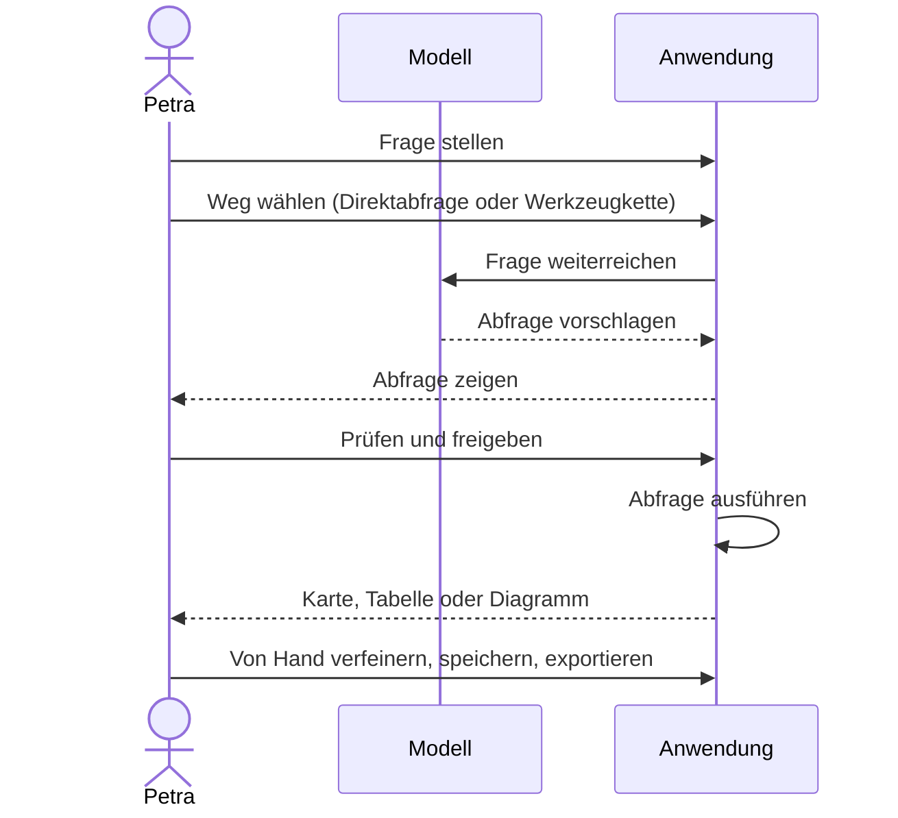
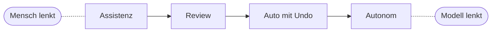
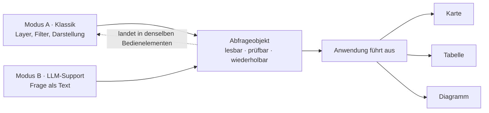
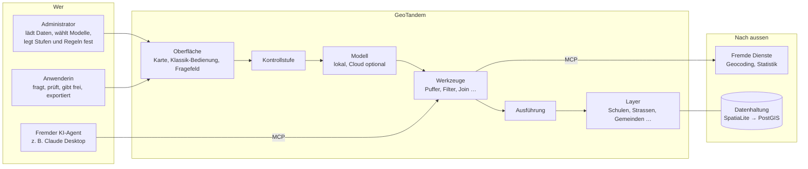
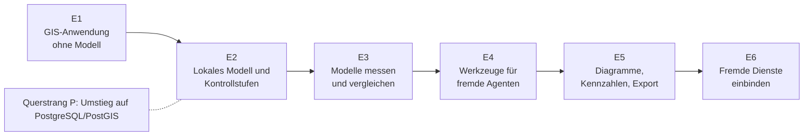

# GeoTandem — User Journey

> Für alle, die neu dazukommen. Die technische Begründung steht in
> [vision.md](../vision.md), das Vokabular in [CONTEXT.md](../CONTEXT.md).

## 1 Die Idee in drei Sätzen

Man stellt eine räumliche Frage in normaler Sprache. Das Modell schlägt eine
Abfrage vor. Der Mensch entscheidet, wie genau er sie vorher sehen will.

| Für wen | Was neu ist | Was bleibt |
|---|---|---|
| Fachleute in Verwaltung und Fachstellen, die keine GIS-Spezialisten sind. | Wie viel das Modell ohne Rückfrage tun darf, ist einstellbar. | Jedes Ergebnis lässt sich als lesbare Abfrage nachprüfen und ohne Modell wiederholen. |

Der Name ist das Bild: Mensch und Modell fahren Tandem. Wer lenkt, lässt sich
einstellen.

## 2 Petras Frage

Petra arbeitet im Schulamt der Beispielregion Tandemtal und hat kein
GIS-Training. Ihre Frage:

> *„Welche Schulen liegen im 500-Meter-Umkreis von Hauptverkehrsstrassen in
> Gebieten mit hohem Kinderanteil?"*

Ohne GeoTandem müsste sie diese Frage zuerst in Layer, Puffer und Filter
übersetzen. Mit GeoTandem läuft es so (hier in der Stufe *Review*):

Die Schritte im Einzelnen:

| # | Schritt | Wer | Was passiert |
|---|---|---|---|
| 1 | Frage stellen | Mensch | Petra tippt ihre Frage ins Fragefeld. |
| 2 | Weg wählen | Mensch | *Direktabfrage* für eine klar umrissene Frage, *Werkzeugkette* für eine offene. Petra entscheidet pro Frage. |
| 3 | Abfrage entwerfen | Modell | Das Modell übersetzt die Frage in eine lesbare Abfrage: Schulen, nahe Hauptstrassen, 500 m, hoher Kinderanteil. |
| 4 | Prüfen und freigeben | Mensch | Petra sieht die Abfrage vor der Ausführung. Ein falscher Layer fällt hier auf, bevor er auf der Karte überzeugend aussieht. |
| 5 | Ausführen | Anwendung | Die Anwendung führt die Abfrage aus. Das Modell fasst die Daten nie selbst an. |
| 6 | Ergebnis ansehen | Mensch | Karte, Tabelle oder Diagramm erscheinen. |
| 7 | Weiterarbeiten | Mensch | Petra verfeinert in der Klassik-Bedienung, speichert die Sitzung und exportiert. |

## 3 Der Regler: wie viel darf das Modell allein?

Die **Kontrollstufe** (im Projekt: HITL-Stufe, *Human in the Loop*) legt fest,
wo Petra eingreift. Der Administrator gibt den Rahmen vor, Petra wählt darin.

So ändert sich Petras Journey je nach Stufe:

| Schritt | Assistenz | Review | Auto mit Undo | Autonom |
|---|---|---|---|---|
| 3 Modell | erklärt, was passen würde | entwirft die Abfrage | entwirft die Abfrage | plant mehrere Schritte selbst |
| 4 Vor der Ausführung | Petra klickt selbst zusammen | **Freigabe** | entfällt | entfällt |
| 6 Nach der Ausführung | ansehen | ansehen | Änderung sehen, **zurücknehmen möglich** | **Endergebnis bestätigen** |

Die vier Stufen sind ein Vorschlag (Option A in [vision.md 8.1](../vision.md)).
Wie die Stufen geschnitten werden, ist bewusst noch offen. Der Demonstrator soll
das ausprobieren.

> **Hinweis:** Die wählbaren Optionen im Werkzeug sind auch für
> Usability-Tests gedacht: Modus A oder B, Direktabfrage oder Werkzeugkette
> und die einzelnen Kontrollstufen. Dieselbe Frage lässt sich so mit verschiedenen
> Einstellungen durchspielen, und Tests zeigen, welche Variante Anwenderinnen
> und Anwender verstehen und ihr vertrauen.

## 4 Zwei Modi, ein gemeinsamer Zustand

GeoTandem lässt sich auf zwei Arten bedienen:

- **Modus A · Klassik:** Layer wählen, Filter setzen, Darstellung gestalten.
  Funktioniert auch ganz ohne Modell.
- **Modus B · LLM-Support:** Die Frage als Text stellen.

Beide erzeugen dasselbe: eine lesbare Beschreibung der Analyse, das
**Abfrageobjekt**. Erst die Anwendung macht daraus ein Ergebnis.

Das Modell ersetzt die Oberfläche nicht, es füllt sie aus. Was das Modell
vorschlägt, kann man danach von Hand weiterbearbeiten. Umgekehrt kann eine von
Hand gebaute Analyse der Ausgangspunkt für eine Frage sein.

## 5 Die Gesamtlandkarte

Die wichtigsten Begriffe in einfachen Worten:

| Begriff | Bedeutung |
|---|---|
| **Layer** | Ein Datenbestand, z. B. alle Schulen oder alle Strassen. |
| **Abfrageobjekt** | Die lesbare Beschreibung einer Analyse. Gleiche Abfrage, gleiches Ergebnis. |
| **Werkzeug** | Eine freigegebene GIS-Operation, z. B. Puffer oder Verschneidung. |
| **Kontrollstufe** | Wie viel das Modell ohne Rückfrage tun darf. |
| **MCP** | Ein Standard, über den KI-Programme Werkzeuge austauschen. GeoTandem bietet so seine Werkzeuge anderen an und nutzt fremde Dienste. |

Grundsatz: **Daten bleiben im Haus.** Der Betrieb mit einem lokalen Modell ist
der Normalfall, die Cloud die bewusst freigeschaltete Ausnahme.

## 6 Drei Ziele und sechs Etappen

Woran wir merken, dass es klappt (Ziffern = Erfolgskriterien in
[vision.md 9](../vision.md)):

**Zugänglich**
- (1) Jemand ohne GIS-Wissen beantwortet eine mehrschichtige Frage per Text.
- (4) Man sieht an einem Beispiel, wie eine Prüfung einen Modellfehler abfängt.
- (3) Dieselbe Frage lässt sich auf beiden Wegen stellen und vergleichen.

**Nachvollziehbar**
- (2) Was das Modell gemacht hat, lässt sich von Hand nachbauen.
- (9) Bevor ein Modell freigegeben wird, ist gemessen, wie gut es ist.
- (6) Auch ein fremder KI-Agent arbeitet unter denselben Regeln.

**Unabhängig**
- (5) Alles läuft lokal mit einem selbst gehosteten Modell.
- (7) Die Datenbank lässt sich wechseln, ohne Code anzupassen.
- (8) Das Modell lässt sich mit vertretbarem Aufwand austauschen.

Der Weg dorthin ([etappen.md](../etappen.md)):

Jede Etappe ist für sich vorführbar.

## 7 Was GeoTandem nicht ist

- Kein Ersatz für QGIS oder ArcGIS
- Kein Werkzeug, um Geodaten zu bearbeiten
- Kein fertiges Produkt für den Betrieb
- Kein eigenes Modelltraining
- Kein allgemeiner Chatbot
- Kein Modell, das selbst Karten zeichnet: Es schlägt nur Abfragen vor, die
  Anwendung führt sie aus

## 8 Weiterlesen

- [vision.md](../vision.md) — Zielbild, Leitprinzipien, offene Designfragen
- [CONTEXT.md](../CONTEXT.md) — verbindliches Vokabular für Code und Dokumente
- [etappen.md](../etappen.md) — Etappen, Arbeitspakete, Abnahmekriterien
- [user-journey.html](user-journey.html) — dieselbe Seite als interaktive Fassung
  mit Stufenregler
